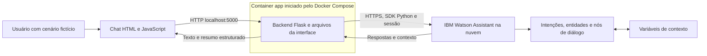
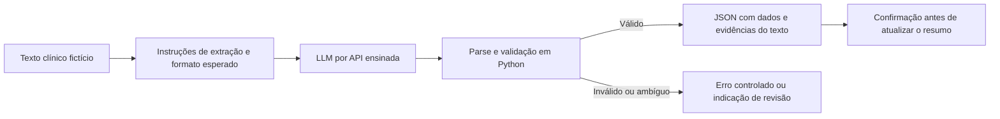
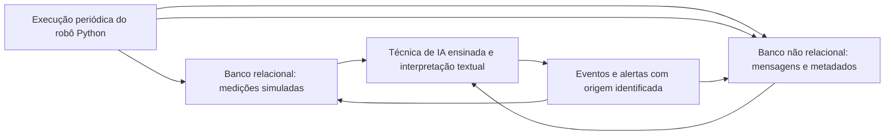

# Plano de implementação do CardioIA - Fase 5

Este plano transforma o enunciado em tarefas implementáveis e verificáveis. A proposta é concluir primeiro o assistente exigido nas Partes 1 e 2, usando **IBM Watson Assistant + Python/Flask + HTML, CSS e JavaScript, com execução obrigatória em Docker**. O escopo autorizado inclui também as duas extensões, Ir Além 1 e Ir Além 2.

**Status: núcleo e ambas as extensões implementados e demonstrados em Docker.** Flask, interface, integração Gemini, robô, SQLite, MongoDB e arquivos Docker foram implementados. As imagens foram construídas e 31 testes passaram nos containers. O assistente CardioIA Fase 5 v2 foi criado no Watson, o diálogo foi importado e o caminho de pressão foi testado no Try it. Gemini foi validado na interface e em seis casos; o robô interpretou três mensagens reais de teste. O fluxo Watson/Gemini passou pela API HTTP real; 38/42 frases inéditas foram classificadas conforme a referência (90,5%). A skill foi exportada pela API oficial, com procedência e hash. A publicação GitHub ficará a cargo do usuário; a demonstração em vídeo está pronta, com 2min52s. Evidências e limitações: `docs/VALIDACAO.md`.

**Decisões confirmadas:** Gemini `gemini-3.5-flash-lite`, conforme solicitação; controle local de até 500 tentativas/24h; SQLite embutido no container do robô; MongoDB em container; Isolation Forest conforme AIRPA. Os dois relatórios das extensões e o relatório do núcleo estão em `output/pdf/`. As caixas abaixo só são concluídas quando o aceite inteiro foi verificado; uma caixa aberta também pode representar verificação ampliada ainda não realizada. As pendências atuais estão discriminadas abaixo, sem confundir previsão inicial com resultado observado.

**Fontes acadêmicas:** `enunciado.md` e o PDF `2TIAOA - Fase 5 - Cap10 - Arquitetura Cognitiva dos LLMs Modernos_RevFinal.pdf`, com 65 páginas. As referências de páginas abaixo correspondem à numeração das páginas do arquivo PDF.

## 1. Escopo e prioridades

| Prioridade | Entrega | Como será atendida |
| --- | --- | --- |
| P0 - obrigatória | Parte 1: assistente conversacional | Skill de diálogo em português brasileiro, com intents, entities, dialog nodes e variáveis de contexto; integração real com a API do Watson pelo backend Python. |
| P0 - obrigatória | Parte 2: interface e apresentação | Chat em HTML integrado ao Flask, repositório GitHub público, documentação e vídeo de até 3 minutos. |
| P0 - requisito adicional do projeto | Execução em Docker, solicitada pelo usuário | `Dockerfile`, `.dockerignore` e `compose.yaml`; aplicação, testes e demonstração executados em containers, com configuração documentada. |
| P1 - extensão | Ir Além 1 | Extração de informações de textos clínicos fictícios por LLM, saída JSON validada, código Python e explicação em PDF. |
| P2 - extensão | Ir Além 2 | Robô Python periódico, dados clínicos simulados em banco relacional, registros em banco não relacional, técnica de IA e alertas rastreáveis. |
| Transversal | Colaboração | Se houver grupo de 4 a 5 integrantes, registrar a divisão e as contribuições para atender à recomendação de equipe. |

As cinco rubricas da entrega obrigatória somam **10 pontos**. O enunciado informa **1 ponto extra** para a formação de equipe recomendada; não informa pontuação nem forma de composição da nota para os dois “Ir Além”. Não assumir pesos para essas extensões.

A execução local será feita em Docker e demonstrada em vídeo. Hospedagem pública da aplicação não aparece como entrega obrigatória; o repositório público aparece. Docker é um requisito adicional explicitamente solicitado pelo usuário, sem peso próprio informado na rubrica da faculdade.

### Premissas adotadas

- A interface será HTML, seguindo o exemplo do capítulo, com uma única aplicação Flask servindo a página e a API.
- A aplicação será construída a partir de um `Dockerfile` e iniciada por Docker Compose. O avaliador precisará de Docker com suporte a containers Linux e Compose, navegador e acesso configurado ao Watson; Python e dependências da aplicação serão instalados na imagem.
- O Watson será responsável por reconhecer intenções, entidades e conduzir o diálogo. As respostas do núcleo serão previamente escritas.
- Os cenários usarão dados fictícios, sem exigir nome completo, documento ou cadastro do paciente.
- O atendimento será uma simulação educativa de coleta e organização de informações; os textos não apresentarão diagnóstico, prescrição ou decisão clínica automática.
- O núcleo não exige banco de dados nem LLM. A persistência em dois tipos de banco pertence ao Ir Além 2.
- Cada quantidade de exemplos, limite de entrada, meta de teste e estimativa de esforço deste plano é uma decisão proposta para o projeto, salvo quando identificada como exigência do enunciado ou orientação do capítulo.

## 2. Correspondência com o conteúdo ensinado

| Conteúdo do capítulo | Referência | Aplicação no projeto |
| --- | --- | --- |
| NLU, NLG e combinação das abordagens | Seção 1.2, p. 8 | Separar a conversa controlada do Watson da extração generativa opcional. |
| Watson Assistant e seus quatro elementos centrais | Seção 1.6, pp. 17-18 | Definir intenções, entidades, árvore de diálogo e contexto antes de implementar as rotas. |
| Instância, experiência clássica, assistants e skills | Seções 1.6.1-1.6.2, pp. 18-22 | Criar uma skill de diálogo em português brasileiro e vinculá-la a um assistente. |
| Exemplos para treinamento de intenções | Seção 1.6.3, pp. 22-25 | Elaborar frases com a mesma intenção e construções diferentes; testar também frases inéditas. |
| Entidades, sinônimos, correspondência aproximada e regex | Seção 1.6.4, pp. 25-28 | Reconhecer sintomas, tipos de medição e padrões explicitamente suportados. |
| Condições, hierarquia de nós e saltos | Seção 1.6.5, pp. 28-34 | Criar perguntas de complemento, reutilizar caminhos e tratar entradas desconhecidas. |
| Persistência de valores entre turnos | Seção 1.6.6, pp. 34-37 | Guardar informações já fornecidas e evitar repetir perguntas. |
| Flask, rota de chat e interface HTML | Seção 2.1, pp. 46-49; códigos-fonte 5 e 6 | Aproveitar a organização servidor/template e a troca de JSON por `fetch`. O modelo GPT-2 desse exemplo não é necessário para o núcleo. |
| APIs de modelos comerciais e instruções de geração | Seção 2.3, pp. 57-60; códigos-fonte 7 a 9 | Referência para integrar um provedor ensinado, caso o Ir Além 1 seja implementado. |
| Watson integrado a módulo generativo | Seção 2.4, pp. 60-63; código-fonte 10 | Adaptar a integração Python/Watson e, na extensão, rotear apenas a operação de extração para o LLM. |

**Material AIRPA recebido e lido:** `2TIAOA - Fase 5 - Cap02 - Do Banco de Dados à Automação Inteligente_RevFinal (1).pdf`, 62 páginas. SQLite: pp. 9-11; pipeline com Isolation Forest, `contamination=0.08` e `random_state=42`: pp. 23-30; MongoDB, Docker e pymongo: pp. 46-48. Essas tecnologias fundamentam o Ir Além 2; não será necessário PostgreSQL. A extração JSON adapta o prompting/API comercial de PCV ao enunciado.

Documentação oficial pode esclarecer compatibilidade e corrigir detalhes de SDK; ela não substitui a exigência acadêmica de utilizar as abordagens ensinadas. Os bancos e a técnica de IA foram confirmados no material AIRPA recebido.

O empacotamento com Docker foi acrescentado por solicitação do usuário. Não atribuir essa exigência ao capítulo; conservar a arquitetura conversacional ensinada dentro do ambiente de execução solicitado.

### Ajustes necessários nos exemplos didáticos

1. **Manter a sessão:** o código-fonte 10 cria uma sessão dentro de cada chamada à rota de chat, na p. 62. No CardioIA, reutilizar a mesma sessão durante a conversa para preservar contexto. A API v2 com estado mantém os dados da conversa por sessão, conforme a [visão geral oficial da API](https://cloud.ibm.com/docs/watson-assistant?topic=watson-assistant-api-overview).
2. **Renderizar mensagens como texto:** o exemplo da p. 48 usa `innerHTML` com a entrada do usuário. Criar elementos e atribuir `textContent` ao implementar o chat, preservando quebras de linha pelo CSS.
3. **Adaptar à interface IBM disponível:** o PDF ensina a experiência clássica. A documentação também descreve a ativação de Dialog em Assistant settings. Registrar o caminho que estiver disponível na conta, preservando intents, entities e dialog nodes. Referência: [Adding dialog](https://cloud.ibm.com/docs/watson-assistant?topic=watson-assistant-skill-dialog-add).
4. **Validar exemplos contra o SDK instalado:** conferir métodos, objetos de retorno, parâmetros e identificadores na primeira integração. Fixar as versões que efetivamente funcionarem; a data de versão da API não é a versão do pacote Python.

## 3. Arquitetura proposta para a entrega obrigatória



### Responsabilidade de cada parte

| Componente | Responsabilidades |
| --- | --- |
| Watson | Classificar a mensagem, extrair entidades, escolher o próximo nó, perguntar informações faltantes e produzir respostas controladas. |
| Backend Flask | Validar a requisição, administrar a sessão, chamar o Watson, tratar falhas e converter o retorno em um contrato simples para a interface. |
| Interface | Exibir a conversa e o resumo, enviar mensagens, indicar processamento e permitir reiniciar o atendimento. |
| Docker e Compose | Construir a imagem, iniciar a aplicação, publicar a porta local, fornecer configuração em execução e permitir testes reproduzíveis. |
| Arquivos do projeto | Conservar código, exemplos fictícios, exportação do Watson, instruções de execução e evidências de teste. |

O backend pode validar formatos numéricos e organizar o resumo, mas a árvore de diálogo deve continuar demonstrável no Watson. Evitar duplicar no Python toda a classificação de intenções e navegação da conversa.

### Sessão e contexto

- Criar uma sessão do Watson ao iniciar o chat e reutilizá-la nos turnos seguintes.
- Usar a sessão da aplicação para associar o navegador à sessão do Watson. Guardar nessa associação somente os identificadores necessários; não colocar o relato clínico no cookie.
- Manter variáveis conversacionais no Watson e solicitar o contexto no retorno quando necessário para montar o resumo. Mapear explicitamente os campos esperados, sem devolver todo o objeto interno ao navegador.
- Encerrar a sessão antiga e limpar o resumo ao reiniciar. A API oferece operações de criação e exclusão de sessão; referência: [API methods summary](https://cloud.ibm.com/docs/watson-assistant?topic=watson-assistant-api-methods).
- Se a sessão expirar, informar que o contexto foi perdido e oferecer um novo atendimento. Não apresentar o resumo anterior como se ainda pertencesse à conversa atual.
- Testar dois navegadores ou perfis independentes para verificar isolamento. Para esta versão, abas de um mesmo perfil podem compartilhar a sessão; documentar esse comportamento.

## 4. Projeto do fluxo conversacional

### 4.1 Conversa principal

1. Dar boas-vindas, explicar o caráter de simulação e apresentar o que o assistente consegue registrar ou explicar.
2. Identificar a necessidade: relatar informações, registrar medição, esclarecer termo de saúde ou consultar o resumo.
3. Capturar apenas os dados presentes na mensagem e perguntar um complemento por vez quando necessário.
4. Preservar respostas já dadas em variáveis de contexto.
5. Apresentar um resumo legível, com campos ausentes identificados como “não informado”.
6. Pedir confirmação do resumo e permitir corrigir um campo.
7. Encerrar ou iniciar outro assunto dentro das capacidades disponíveis.

O reconhecimento de um cenário de urgência previsto no roteiro deve interromper a coleta comum e apresentar uma resposta previamente revisada de encaminhamento a atendimento profissional. Isso é um cenário demonstrativo de diálogo, não um classificador clínico validado.

### 4.2 Intenções iniciais propostas

Os nomes abaixo são uma proposta de modelagem, não nomes exigidos pela faculdade. Começar com **5 a 10 exemplos por intenção** e ampliá-los conforme os erros encontrados. O capítulo orienta pelo menos 5 e, idealmente, até 30 exemplos por intenção na p. 23; essa orientação didática não deve ser descrita como limite técnico da plataforma.

| Intenção | Exemplo fictício de entrada | Comportamento esperado |
| --- | --- | --- |
| `#saudacao` | “Olá, quero começar” | Acolher e apresentar opções. |
| `#ajuda` | “O que você consegue fazer?” | Explicar capacidades e oferecer caminhos válidos. |
| `#relatar_sintomas` | “Tenho sentido palpitações” | Registrar o relato e solicitar complemento previsto. |
| `#informar_medicao` | “Quero registrar minha pressão” | Identificar o tipo de medição e pedir valor/unidade se faltarem. |
| `#informar_historico` | “Quero informar meu histórico de saúde” | Registrar informação declarada, sem inferir diagnóstico. |
| `#duvida_saude` | “O que significa frequência cardíaca?” | Responder por um texto educativo previamente revisado. |
| `#solicitar_conduta_medica` | “Qual remédio devo tomar?” | Explicar o limite da simulação e orientar contato profissional. |
| `#relatar_urgencia` | “Preciso de atendimento urgente” | Acionar o caminho prioritário previsto no roteiro. |
| `#consultar_resumo` | “Mostre o que eu informei” | Exibir os dados disponíveis, inclusive campos ainda ausentes. |
| `#confirmar` | “Isso está correto” | Confirmar somente quando houver uma pergunta de confirmação ativa. |
| `#corrigir_informacao` | “Quero corrigir a medição” | Perguntar o campo e substituir apenas o valor indicado. |
| `#reiniciar` | “Quero começar de novo” | Reiniciar a sessão e limpar o contexto da conversa. |
| `#encerrar` | “Obrigado, pode encerrar” | Finalizar o diálogo e apresentar uma despedida. |

O fallback será um nó `anything_else`, não uma intenção treinada para englobar qualquer mensagem. Frases de confirmação ou correção fora do contexto apropriado precisam de uma pergunta de esclarecimento.

### 4.3 Entidades e variáveis de contexto

| Entidade ou dado | Conteúdo proposto | Destino no contexto |
| --- | --- | --- |
| `@sintoma` | Vocabulário limitado de sintomas do roteiro, com sinônimos | `$sintomas_relatados` e `$relato_original` |
| `@tipo_medicao` | Pressão arterial; frequência cardíaca | `$tipo_medicao` |
| `@pressao_arterial` | Padrão explícito como `120/80`, acompanhado da confirmação da unidade | `$pressao_informada` |
| `@sys-number` | Valor numérico quando o nó atual espera um número | `$valor_medicao` |
| `@unidade_medicao` | `mmHg` ou `bpm`, conforme o fluxo | `$unidade_medicao` |
| `@campo_correcao` | Relato, início, pressão, frequência ou histórico | `$campo_em_correcao` |
| Resposta textual contextual | Início/duração, histórico declarado ou outro complemento | `$inicio_relatado`, `$historico_declarado` |

Manter também `$etapa_atual`, `$resumo_confirmado` e um contador de tentativas de esclarecimento. Ao corrigir um dado, invalidar a confirmação anterior do resumo.

Regras de captura propostas:

- Uma entidade encontrada vale para aquela mensagem; copiar para contexto quando o dado precisar permanecer nos próximos turnos, como ensinado nas pp. 35-37.
- Preservar o valor literal de entidades por padrão/regex, seguindo o mecanismo ilustrado na p. 37 e validando a sintaxe na skill real.
- Não interpretar todo número como medição. A intenção, o tipo de medição e a etapa atual precisam ser compatíveis.
- Tratar entrada como `12/8` ou valor sem unidade por esclarecimento; não converter ou completar silenciosamente.
- A presença da palavra “dor” em “não tenho dor” não confirma sintoma. Guardar o relato original, cobrir negações nos cenários e pedir confirmação quando a interpretação não for confiável.
- Quando vários dados vierem juntos, aproveitar os reconhecidos e perguntar somente o que ainda falta, usando condições e saltos conforme as pp. 33-34.
- Validar formato e completude sem transformar números em classificação de risco clínico no núcleo.

### 4.4 Organização dos nós

| Grupo de nós | Regras de navegação |
| --- | --- |
| Boas-vindas | Acionado na inicialização explícita da conversa. |
| Interrupções | Reinício, encerramento e cenário de urgência devem ser alcançáveis mesmo durante uma pergunta de complemento. |
| Coleta de informações | Nós por intenção, com filhos para dado disponível, dado ausente e entrada ambígua. |
| Explicações educativas | Respostas curtas sobre um conjunto pequeno de termos previstos. |
| Limites de atuação | Caminho para pedidos de diagnóstico, prescrição e conduta individualizada. |
| Resumo e correção | Consolidar contexto, confirmar e voltar ao campo escolhido. |
| Fallback | Último nó aplicável; pedir reformulação e apresentar opções após duas tentativas sem progresso. |

Definir condições específicas antes das genéricas. A prioridade não depende apenas da posição de um nó na raiz: verificar também a saída dos nós filhos e o comportamento das interrupções. Testar todos os saltos para evitar ciclos sem saída.

### 4.5 Resumo estruturado

Contrato ilustrativo para um cenário fictício, sem significado de avaliação clínica:

```json
{
  "relato_original": "Quero registrar uma pressão de 120/80 mmHg",
  "sintomas_relatados": [],
  "inicio_relatado": null,
  "pressao_arterial": {
    "sistolica": 120,
    "diastolica": 80,
    "unidade": "mmHg",
    "texto_original": "120/80 mmHg"
  },
  "frequencia_cardiaca": null,
  "historico_declarado": null,
  "confirmado_pelo_usuario": false
}
```

Campos vazios significam ausência de informação registrada. Uma lista de sintomas vazia não equivale a afirmar que a pessoa não tem sintomas. O resumo exibirá os valores como relatados pelo usuário.

## 5. Contrato do backend e estrutura de arquivos

### Rotas propostas

| Rota | Entrada | Saída/comportamento |
| --- | --- | --- |
| `GET /` | Nenhuma | Entregar `index.html`. |
| `GET /health` | Nenhuma | Retornar o estado do processo HTTP para o healthcheck do container, sem chamar o Watson nem criar sessões. |
| `POST /api/chat/start` | Nenhuma informação clínica | Criar ou recuperar a sessão da conversa e obter a mensagem inicial sem consumir a primeira mensagem do usuário. |
| `POST /api/chat` | JSON com `message` textual | Enviar ao Watson usando a sessão atual e retornar texto e resumo disponível. |
| `POST /api/chat/reset` | Nenhuma informação clínica | Encerrar a sessão anterior, limpar dados locais relacionados e começar novo atendimento. |

Resposta de sucesso proposta:

```json
{
  "response": "Medição registrada. Deseja conferir o resumo?",
  "summary": null
}
```

`summary` será `null` enquanto não houver um resumo a apresentar, ou um objeto com os campos permitidos da seção 4.5. Se o Watson retornar vários blocos de texto, preservar sua ordem. Tipos adicionais de resposta somente serão usados se a interface também os implementar.

Erros previstos: requisição inválida (`400`), sessão expirada (`409`) e indisponibilidade do serviço externo (`503`). A resposta terá `error.code` e `error.message`, com mensagem compreensível e sem credenciais ou rastreamento interno de exceção.

Limitar inicialmente a mensagem a 2.000 caracteres como regra da aplicação. Conferir separadamente os limites da API real e reduzir esse valor se necessário. Desabilitar envios simultâneos na interface e configurar timeout no cliente externo.

### Estrutura alvo

```text
cap1-fase5-v2/
├── app.py
├── config.py
├── services/
│   ├── __init__.py
│   ├── watson_service.py
│   └── clinical_summary.py
├── templates/
│   └── index.html
├── static/
│   ├── css/styles.css
│   └── js/chat.js
├── watson/
│   ├── assistant-skill.json
│   └── README.md
├── data/
│   └── exemplos_simulados.json
├── tests/
│   ├── test_chat_api.py
│   ├── test_watson_service.py
│   ├── test_clinical_summary.py
│   └── cenarios_conversacionais.json
├── docs/
│   ├── fluxo-conversacional.md
│   ├── relatorio-fluxo.pdf
│   ├── roteiro-video.md
│   ├── evidencias-testes.md
│   └── equipe.md
├── requirements.txt
├── Dockerfile
├── .dockerignore
├── compose.yaml
├── .env.example
├── .gitignore
├── README.md
└── PLANO_IMPLEMENTACAO.md
```

Essa é a estrutura a criar durante a implementação. Os arquivos do material didático permanecem disponíveis localmente, mas não precisam integrar o repositório público. A exportação final do Watson deve ser a versão efetivamente testada.

Dependências do núcleo: Flask, SDK `ibm-watson` e o autenticador `IAMAuthenticator` de `ibm-cloud-sdk-core`, conforme a integração do capítulo. Para verificações locais, preferir `unittest`, `unittest.mock` e o cliente de testes do Flask.

Configurações previstas: `WA_API_KEY`, `WA_URL`, `WA_ASSISTANT_ID`, `WA_API_VERSION` e `FLASK_SECRET_KEY`. Validar o identificador de execução/ambiente exigido pela experiência IBM utilizada. `.env.example` documenta nomes e valores fictícios. Na execução local, copiar esse modelo para `.env` e preencher a configuração; declarar explicitamente as variáveis de cada serviço no atributo `environment` do Compose. `os.getenv` lerá o ambiente do processo dentro do container. A existência de `.env` no host, por si só, não injeta suas variáveis no container, conforme a [documentação de variáveis do Compose](https://docs.docker.com/compose/how-tos/environment-variables/set-environment-variables/).

### Execução obrigatória em Docker

O serviço principal se chamará `app`. O Flask servirá a interface e a API em `0.0.0.0:5000` dentro do container, com debug e recarregamento automático desativados na demonstração. O Compose publicará `127.0.0.1:5000:5000`, permitindo acesso pelo navegador em `http://localhost:5000`. Watson e eventual provedor de LLM continuarão como serviços externos acessados por HTTPS.

| Arquivo | Conteúdo previsto |
| --- | --- |
| `Dockerfile` | Imagem oficial Python com versão explícita, diretório de trabalho, instalação das dependências fixadas, cópia dos arquivos necessários, usuário sem privilégios de root e comando de inicialização. A imagem deve conter também os testes e dados fictícios usados na verificação. |
| `.dockerignore` | Excluir `.git`, `.env`, outros arquivos locais de credenciais, ambientes virtuais, caches e o PDF didático; manter código, templates, arquivos estáticos, testes e exemplos necessários. |
| `compose.yaml` | Serviço `app`, construção da imagem, porta local, configuração explícita em execução e healthcheck HTTP. A execução de entrega usará código contido na imagem, sem depender de caminhos absolutos ou montagem do código do host. |
| `.env.example` | Somente nomes de configuração e valores fictícios; o `.env` preenchido ficará fora do Git e do contexto de build. |

A divisão entre imagem, configuração de execução e contexto de build segue o [guia oficial Docker para Python](https://docs.docker.com/guides/python/). Selecionar a versão da imagem após conferir a compatibilidade das dependências, evitando a tag `latest`. O build deve funcionar sem credenciais Watson; as credenciais serão fornecidas somente ao executar a aplicação.

Comandos alvo para o README, a validar durante a implementação:

```powershell
# Somente na primeira configuração: copiar o modelo e preencher o .env localmente.
Copy-Item .env.example .env

# Validar a configuração sem imprimir valores de variáveis.
docker compose config --quiet

# Construir a imagem e iniciar a aplicação.
docker compose up --build -d

# Conferir o serviço e acompanhar o log.
docker compose ps
docker compose logs -f app

# Executar os testes de código no container, com a aplicação iniciada.
docker compose exec app python -m unittest discover -s tests -v

# Encerrar o ambiente.
docker compose down
```

O healthcheck verifica o processo local; uma conversa real será usada para comprovar conexão e autenticação no Watson. Registrar o comportamento das sessões após recriar o container e manter `FLASK_SECRET_KEY` estável na configuração. Os testes locais usarão mocks para chamadas externas, mesmo quando executados dentro da imagem.

## 6. Tarefas da entrega obrigatória

Cada caixa abaixo representa uma tarefa de implementação e aceite. As dependências definem a ordem técnica; trabalho independente pode ser dividido entre integrantes da equipe.

### Fase 0 - Preparação e verificação da plataforma

**Esforço estimado:** 3-5 horas-pessoa. **Dependência:** nenhuma.

- [ ] **T01 - Fechar o escopo do núcleo.** Registrar os caminhos conversacionais, quais dados serão coletados, o conjunto de respostas educativas e os critérios de avaliação. Anotar integrantes, responsabilidades e prazo real de entrega. **Aceite:** escopo escrito em `docs/fluxo-conversacional.md`, sem depender das extensões.
- [x] **T02 - Verificar acesso ao Watson.** Conferir conta, região, plano disponível, Dialog, português brasileiro, exportação e identificadores de API. O acesso acadêmico/Lite sugerido nas pp. 18-19 deve ser conferido na conta; não presumir gratuidade ou benefício ativo. Criar uma skill mínima e verificar uma chamada real à API. **Aceite:** uma mensagem enviada por Python recebe resposta da skill vinculada; caminho de configuração registrado sem segredos.
- [x] **T03 - Preparar o projeto e os pré-requisitos Docker.** Inicializar Git, lista de dependências, `.gitignore` e documentação das variáveis. Verificar Docker Engine, containers Linux e `docker compose version`; no Windows, validar o ambiente Docker Desktop disponível. Ignorar credenciais, caches e materiais didáticos locais na futura publicação. **Aceite:** runtime Docker e Compose disponíveis; Python instalado no host não é requisito para executar a entrega.

**Marco M0:** configuração IBM viável e integração mínima comprovada. Se Dialog não estiver disponível, registrar o impedimento e alinhar a alternativa com a disciplina antes de trocar a arquitetura exigida. Modelagem do diálogo, interface e testes com respostas simuladas podem avançar enquanto o acesso é resolvido, mas não comprovam a integração real.

### Fase 1 - Modelagem e construção no Watson

**Esforço estimado:** 6-10 horas-pessoa. **Dependências:** T01 e T02.

- [x] **T04 - Escrever os roteiros.** Detalhar conversa principal, medição, dúvida educativa, correção, encerramento, urgência simulada e fallback. Indicar para cada etapa entrada esperada, dado salvo e saída. **Aceite:** fluxograma e caminhos documentados em `docs/fluxo-conversacional.md`, com definição completa das respostas em `watson/build_skill.py`.
- [x] **T05 - Preparar dados de intenções e entidades.** Criar os exemplos da seção 4, sinônimos e padrões; separar pelo menos 3 frases inéditas por intenção para avaliação. Evitar usar a mesma frase para treinar e comprovar reconhecimento. **Aceite:** catálogo revisado, exemplos fictícios e conjunto de avaliação separado.
- [x] **T06 - Construir a árvore e o contexto.** Configurar nós, filhos, condições, variáveis e saltos; testar dados em mensagens separadas e documentar a limitação quando medidas distintas chegam juntas. **Aceite:** resumo e correção comprovados; comandos globais precedem a captura livre. A saída da coleta de duração foi verificada pelo resumo; não se afirma teste exaustivo de todas as combinações.
- [x] **T07 - Exportar e documentar a skill.** Gerar `watson/assistant-skill.json`, documentar vínculo com o assistente e registrar um primeiro teste no Try it. **Aceite:** JSON exportado pelo serviço e sem credenciais; importação verificável em skill de teste quando a conta permitir.

**Marco M1:** fluxo principal e exceções básicos funcionando no Watson, antes da integração completa com a interface.

### Fase 2 - Backend Python e integração

**Esforço estimado:** 8-12 horas-pessoa. **Dependências:** T03 e uma skill funcional de T06.

- [x] **T08 - Organizar a aplicação Flask.** Criar configuração e rotas da seção 5, separando chamadas externas da lógica HTTP. **Aceite:** aplicação inicia com instruções claras e sinaliza configuração ausente sem expor valores secretos.
- [x] **T09 - Implementar o cliente Watson.** Configurar SDK, autenticador e URL; encapsular criação/exclusão de sessão e envio de mensagens; mapear respostas textuais. **Aceite:** chamada real retorna conteúdo da skill correta; falhas externas são convertidas em erro controlado.
- [x] **T10 - Implementar o ciclo de sessão.** Conservar sessão entre turnos, isolar navegadores, tratar expiração, reset e encerramento. **Aceite:** o segundo turno aproveita dados do primeiro; reinício elimina os dados antigos; perfis independentes não compartilham contexto.
- [x] **T11 - Validar entradas e montar o resumo.** Rejeitar corpo inválido, mensagem vazia/tipo incorreto/excessiva; extrair apenas campos previstos do contexto; preservar ausências e correções. **Aceite:** o JSON corresponde ao relato confirmado e não inclui dados internos da API.

**Marco M2:** uma conversa de múltiplos turnos pode ser concluída pela API local usando o Watson real.

### Fase 2.1 - Empacotamento e execução Docker

**Esforço adicional estimado:** 4-6 horas-pessoa. **Dependências:** T03 e T08 para iniciar D01-D03; T09-T14 e T16 para concluir a validação completa D04.

- [x] **D01 - Criar Dockerfile e .dockerignore.** Implementar a imagem Python e as exclusões da seção 5; copiar dependências antes do código para aproveitar cache de build; executar com usuário sem privilégios. **Aceite:** `docker compose build app`, após D02, produz imagem sem depender de Python do host ou credenciais na construção; arquivos privados não estão na imagem.
- [x] **D02 - Criar o Docker Compose.** Definir serviço `app`, build, publicação da porta, configuração em execução e healthcheck `/health` usando recursos disponíveis na imagem. **Aceite:** `docker compose up --build -d` inicia a aplicação e `docker compose ps` mostra o serviço saudável; a página abre em `http://localhost:5000`.
- [x] **D03 - Documentar configuração e operação.** Atualizar `.env.example` e README com pré-requisitos, variáveis por serviço, build, início, logs, testes, encerramento e solução de porta ocupada. Garantir que segredos não entrem em `ARG`, `ENV` do Dockerfile ou arquivos copiados para a imagem. **Aceite:** configuração explicada sem valores secretos, com execução padrão inteiramente pelo Docker.
- [x] **D04 - Validar a entrega em containers.** Construir a imagem do código final, executar os testes e a conversa real no navegador, parar/recriar o serviço e repetir a verificação em ambiente limpo. Conferir os cenários C21-C25. **Aceite:** projeto reproduzível com Docker e credenciais configuradas, sem instalação manual de dependências Python no host.

**Marco MD:** imagem, Compose e execução comprovados. D04 será concluída junto à Fase 4; MD é condição necessária para M4 e para a gravação do vídeo final.

### Fase 3 - Interface funcional

**Esforço estimado:** 4-6 horas-pessoa. **Dependências:** contrato da seção 5; conexão real após T08-T11 e D01-D03.

- [ ] **T12 - Construir a página de chat.** Incluir identificação do CardioIA, explicação breve da simulação, histórico, campo de texto, botão de envio e botão de reinício. Exibir o resumo em uma área legível quando ele existir. **Aceite:** uso por teclado, rótulos claros e layout utilizável no computador e em tela estreita.
- [x] **T13 - Integrar o envio e a inicialização.** Usar `fetch` nas rotas do Flask, apresentar mensagens em ordem, permitir Enter e indicar processamento. **Aceite:** conversa no navegador percorre o mesmo fluxo validado na API; primeira mensagem não se perde na saudação.
- [x] **T14 - Tratar estados e erros.** Desabilitar envio vazio/duplicado durante a espera, exibir falha de conexão, expiração e erro do serviço; renderizar texto com `textContent`. **Aceite:** interface permanece utilizável após falha e limpa histórico/resumo ao reiniciar.

**Marco M3:** fluxo completo navegador → Flask no container → Watson → navegador demonstrável com dados fictícios.

### Fase 4 - Verificação e ajustes

**Esforço estimado:** 6-9 horas-pessoa. **Dependências:** M3; preparação dos cenários pode começar em T04.

- [ ] **T15 - Consolidar os cenários de aceitação.** Transformar a seção 7 em entradas, resultados esperados e evidências. Incluir frases fora do treinamento. **Aceite:** cenários cobrem os requisitos e possuem resultados verificáveis.
- [x] **T16 - Automatizar testes do backend.** Usar respostas simuladas do SDK para validar contratos, sessões, resumo e falhas, sem consumir a API em todo teste local. Executar a suíte dentro do container. **Aceite:** verificações passam pelo comando Docker documentado e os casos de falha relevantes estão cobertos.
- [ ] **T17 - Executar avaliação real no Watson e no navegador.** Rodar fluxos de aceitação e conjunto de frases inéditas; registrar acertos, confusões, correções e limitações. **Aceite:** todos os fluxos essenciais da seção 7 passam na integração real.
- [ ] **T18 - Conferir reprodução e exportação final.** Preparar ambiente limpo ou usar máquina de outro integrante com Docker; construir a imagem, configurar o serviço via Compose, importar a exportação e repetir uma conversa. Se limites da conta impedirem nova skill, registrar exatamente qual verificação ficou pendente. **Aceite:** procedimento reproduzível sem Python no host e exportação correspondente à versão demonstrada.

**Marco M4:** entrega obrigatória validada, incluindo MD e os cenários Docker; extensões não devem comprometer esse estado funcional.

### Fase 5 - Documentação e entrega

**Esforço estimado:** 4-6 horas-pessoa. **Dependências:** M4; rascunhos podem acompanhar a implementação.

- [x] **T19 - Finalizar o README e a documentação do Watson.** Explicar objetivo, arquitetura, pré-requisitos Docker, configuração do `.env`, importação/vínculo da skill, build, execução, logs, testes e encerramento pelo Compose. **Aceite:** instruções bastam para outra pessoa executar o projeto em containers com suas próprias credenciais.
- [x] **T20 - Produzir o relatório de 1 a 2 páginas.** Cobrir finalidade, intenções/entidades, fluxo e contexto, integração e um exemplo de interação; incluir limitações. O enunciado não fixa formato para esse relatório; propõe-se PDF para entrega, com fonte editável em Markdown. **Aceite:** PDF legível com efetivamente 1 ou 2 páginas.
- [ ] **T21 - Preparar e publicar o repositório público.** Revisar os arquivos rastreados, remover segredos do conteúdo e do histórico antes da publicação, organizar autoria e incluir os entregáveis. O PDF didático identificado para uso do aluno deve ficar fora da publicação. **Aceite:** URL acessível sem login, código completo e documentação disponível.
- [x] **T22 - Gravar e revisar o vídeo.** Demonstrar o serviço em execução no Docker, conversa real, contexto, resumo e uma exceção conforme o roteiro da seção 9. Não mostrar credenciais. **Aceite:** vídeo com duração de até 3 minutos, aplicação executada em container e link/arquivo acessível ao avaliador.
- [ ] **T23 - Conferir a entrega contra o enunciado.** Verificar links, exportação, código, relatório e vídeo; registrar versão final e contribuições da equipe. **Aceite:** checklist da seção 11 concluído para todas as partes escolhidas.

**Marco M5:** pacote obrigatório pronto para envio à faculdade.

## 7. Cenários e critérios de aceitação

| ID | Cenário | Resultado esperado | Verificação |
| --- | --- | --- | --- |
| C01 | Abrir o chat e enviar a primeira mensagem | Boas-vindas exibidas e entrada do usuário processada uma vez | Navegador + Watson real |
| C02 | Frase inédita de uma intenção conhecida | Caminho compatível ou esclarecimento apropriado | Watson real |
| C03 | “Quero registrar minha pressão” seguido de “120/80 mmHg” | Segunda mensagem completa a coleta anterior | API + navegador |
| C04 | Medição e unidade na mesma mensagem | Dado aproveitado sem pergunta repetida | Watson real |
| C05 | Número solto, unidade ausente ou `12/8` | Pergunta de esclarecimento, sem conversão silenciosa | Watson real |
| C06 | Relato com negação | Resumo não converte negação em sintoma confirmado | Watson real + revisão do resumo |
| C07 | Consulta de resumo parcial | Campos não fornecidos permanecem ausentes | Teste local + navegador |
| C08 | Correção após resumo | Somente campo escolhido muda e confirmação anterior é invalidada | API + Watson real |
| C09 | Confirmação fora de uma pergunta ativa | Assistente esclarece o que pode ser confirmado | Watson real |
| C10 | Mensagem desconhecida duas vezes | Fallback apresenta opções e permite continuar | Watson real |
| C11 | Pedido de diagnóstico ou medicamento | Resposta controlada respeita os limites definidos | Watson real |
| C12 | Cenário de urgência previsto durante uma coleta | Interrupção prioritária funciona sem concluir perguntas comuns | Watson real |
| C13 | Encerrar ou reiniciar no meio de um nó filho | Saída acessível; novo atendimento sem contexto antigo | API + navegador |
| C14 | Dois perfis de navegador | Relatos e resumos isolados | Navegadores independentes |
| C15 | Sessão expirada | Mensagem clara e reinício disponível; dados antigos não reaparecem | Teste local e expiração real, se viável |
| C16 | JSON inválido, texto vazio ou tipo errado | Erro `400` consistente | Teste local |
| C17 | Timeout, indisponibilidade ou falha de autenticação do Watson | Erro controlado; nenhum segredo exposto | Teste local com falha simulada |
| C18 | Texto com tags HTML | Conteúdo exibido literalmente | Navegador |
| C19 | Clique repetido em enviar | Um envio enquanto a requisição está em andamento | Navegador |
| C20 | Exportação em ambiente configurado pelas instruções | Fluxo compatível com a versão entregue | Reprodução da configuração |
| C21 | Build a partir de checkout limpo, sem credenciais disponíveis ao build | Imagem construída com dependências fixadas e arquivos necessários | Docker build |
| C22 | Iniciar pelo Compose e acessar o navegador | Container saudável e página/API acessíveis pela porta documentada | Docker Compose + navegador |
| C23 | Executar a suíte no container | Testes passam sem Python ou dependências instalados no host | Docker Compose exec |
| C24 | Parar e recriar o container | Aplicação volta a funcionar; sessão preservada ou reiniciada de forma explícita, sem misturar contextos | Docker Compose + conversa real |
| C25 | Configuração ausente e revisão do conteúdo da imagem | Erro compreensível; nenhum `.env` preenchido ou segredo embutido na imagem | Configuração e inspeção sem imprimir valores secretos |

Meta interna inicial: reconhecer corretamente pelo menos **85% das frases inéditas rotuladas**. Registrar quantidade total, acertos por intenção e erros, pois o conjunto é pequeno. Essa meta é proposta para orientar ajustes, não é critério da faculdade nem evidência de eficácia clínica. Quando frases da avaliação forem usadas para retreinar, criar uma nova amostra inédita para a avaliação final.

Todos os cenários essenciais, especialmente contexto, isolamento, correção, fallback e limites de atuação, devem passar independentemente da taxa agregada de reconhecimento. Testes com mocks comprovam comportamento do código; não substituem a demonstração com o Watson real.

## 8. Extensões “Ir Além”

### 8.1 Ir Além 1 - Extração com IA Generativa

**Objetivo:** receber um texto clínico fictício, extrair somente as informações presentes e produzir um JSON verificável. Começar por texto: o enunciado permite textos **ou** imagens, e o capítulo oferece exemplos de integração textual. Uma entrada por imagem poderá ser planejada depois de confirmar o exemplo multimodal ensinado na fase.

**Dependências:** M4 para incorporar ao chat; a definição dos dados pode começar antes. Selecionar um provedor e um modelo dentre as abordagens ensinadas na seção 2.3 e confirmar acesso e compatibilidade antes da implementação da chamada real. A entrega obrigatória continua executável sem essa configuração.

**Esforço adicional estimado:** 12-20 horas-pessoa.

Fluxo proposto:



- [x] **G01 - Definir entradas e esquema.** Preparar inicialmente 12 a 20 textos fictícios e os JSONs esperados. Incluir informação ausente, negação, valores contraditórios e texto sem conteúdo clínico. Usar os campos da seção 4.5 com trechos de evidência para os dados extraídos. **Aceite:** conjunto de referência revisado por uma pessoa e disponível em arquivo.
- [x] **G02 - Elaborar o prompt.** Adaptar as instruções de papel e tarefa das pp. 57-63 para extração: usar somente o texto fornecido, não diagnosticar, não completar valores e responder no esquema definido. Delimitar o relato como dado de entrada, sem obedecer a instruções contidas nele. **Aceite:** prompt versionado e cada instrução ligada a um resultado esperado.
- [x] **G03 - Implementar o extrator Python.** Criar um módulo executável que receba texto e devolva dados estruturados; escolher um único SDK dentre os exemplos ensinados, parametrizar modelo e limites e tratar indisponibilidade. Incluir as dependências selecionadas na imagem Docker e documentar o comando de execução no container; validar credenciais opcionais somente ao ativar a extensão. **Aceite:** ao menos uma extração real reproduzível em Docker, com configuração de credenciais externa à imagem e ao código.
- [x] **G04 - Validar o resultado.** Fazer parse do JSON e validar campos, tipos, unidades, ausências e correspondência dos valores com o texto. Uma resposta inválida deve gerar resultado de falha identificado; não inventar dados para preencher o esquema. **Aceite:** casos contraditórios ou incompletos não viram informação confirmada.
- [x] **G05 - Integrar a operação ao assistente.** Acrescentar uma intenção específica de extração e uma rota de processamento delimitada, seguindo o exemplo híbrido. O Watson mantém os fluxos comuns; a extração só é chamada no caminho correspondente. Mostrar o resultado e solicitar confirmação antes de incorporar os dados ao contexto. **Aceite:** ausência ou falha do LLM não interrompe o chat obrigatório. Esta integração é a evolução proposta; o código independente já atende ao formato de implementação permitido pelo enunciado.
- [ ] **G06 - Avaliar e documentar.** Comparar saídas com o conjunto de referência, registrar proporção de JSON válido, acerto por campo, campos indevidamente preenchidos e limitações. Repetir alguns casos para observar variação, sem declarar que baixa temperatura garante determinismo. **Aceite:** evidências de execução e erros reais documentadas.
- [x] **G07 - Entregar a explicação em PDF.** Descrever entrada, esquema, prompt, chamada ao modelo, validações, exemplos, resultados e integração. **Aceite:** código Python funcional e PDF que explique todo o fluxo implementado, como pedido no enunciado.

Arquivos adicionais previstos:

```text
extensions/generative/extract_clinical.py
extensions/generative/prompt.txt
extensions/generative/requirements.txt
data/generative/casos.json
data/generative/resultados_esperados.json
tests/test_clinical_extraction.py
docs/ir-alem-1-fluxo.md
docs/ir-alem-1-fluxo.pdf
```

Critérios mínimos da extensão: extração real por modelo, JSON válido nos casos aceitos, valores ausentes preservados, negações e conflitos tratados, comportamento controlado diante de saída inválida e relatório coerente com o código. Validade sintática do JSON não comprova fidelidade ao texto; as duas verificações são necessárias.

### 8.2 Ir Além 2 - Automação, IA e dados híbridos

**Objetivo:** executar um robô Python que consulte dados clínicos simulados periodicamente, interprete informações textuais, aplique a técnica de IA estudada e registre eventos e alertas rastreáveis.

**Dependências:** material AIRPA confirmado; M4 antes de concluir a integração da extensão ao projeto final. Esta extensão não precisa depender da implementação do Ir Além 1. Se houver uso de NLP para mensagens, verificar a integração ensinada e reaproveitar o componente compatível já disponível.

**Esforço adicional estimado:** 16-28 horas-pessoa, a revisar depois da leitura do material de AIRPA.

**Execução Docker da extensão:** acrescentar ao Compose um perfil `automacao` com o robô Python e os dois bancos selecionados em R01, usando versões explícitas das imagens e volumes nomeados para os dados. O robô será um serviço separado da aplicação web, para não duplicar execuções ao iniciar o Flask. Usar nomes dos serviços na rede Compose para conexão aos bancos, healthchecks e espera pela disponibilidade. O serviço `app` continua ativo por padrão; os componentes da automação serão iniciados com `docker compose --profile automacao up --build -d`, conforme o mecanismo de [perfis do Compose](https://docs.docker.com/compose/how-tos/profiles/).

Não selecionar antecipadamente produtos como banco SQL, banco de documentos ou agendador sem localizar sua correspondência nas aulas. O desenho lógico abaixo permite preparar a implementação sem presumir ferramentas que o enunciado restringe.



#### Estruturas lógicas propostas

| Armazenamento | Estrutura | Campos principais |
| --- | --- | --- |
| Relacional | `pacientes_simulados` | `paciente_id`, identificador fictício e atributos estritamente necessários ao cenário |
| Relacional | `medicoes` | `medicao_id`, `paciente_id`, `instante_medicao`, tipo, valor/unidade e origem simulada; pressão pode usar campos próprios para os dois valores |
| Relacional | `adesao_simulada` | `registro_id`, `paciente_id`, instante e estado de adesão conforme definição do conjunto de dados |
| Relacional | `alertas` | `alerta_id`, registro de origem, `execucao_id`, tipo, motivo, versão da técnica/regra, instante, status e chave de deduplicação |
| Não relacional | `mensagens_pacientes` | Identificador, `paciente_id` fictício, texto, instante e metadados de interpretação |
| Não relacional | `execucoes_robo` | `execucao_id`, início/fim, status, quantidade lida, quantidade processada, alertas e erros |
| Não relacional | `eventos` | `execucao_id`, registro de origem, etapa, resultado, motivo e versão da configuração |

Adaptar os nomes e tipos à tecnologia ensinada. Se a aula usar outro modelo não relacional, adequar essa estrutura em vez de forçar coleções de documentos.

- [x] **R01 - Mapear AIRPA para decisões de implementação.** Identificar banco relacional, banco não relacional, mecanismo de execução periódica e técnica de IA com capítulo/página ou exemplo de aula; verificar como executar as tecnologias selecionadas em containers Linux. **Aceite:** decisões fundamentadas no material e compatíveis com a execução Docker solicitada. Regras de limiar, por si só, não devem ser apresentadas como prova de uso de IA se isso não corresponder ao conteúdo da disciplina.
- [x] **R02 - Criar esquemas e dados fictícios.** Preparar scripts de criação e carga de pelo menos três situações: sem evento, evento esperado e dado inválido/ausente. Incluir mensagens textuais. **Aceite:** os dois bancos podem ser preparados seguindo instruções reproduzíveis e os relacionamentos por identificador são consistentes.
- [x] **R03 - Implementar uma execução completa.** Ler medições, adesão e mensagens de uma janela de tempo; validar os registros; executar o processamento; registrar início e resultado. **Aceite:** modo de execução única permite depurar o fluxo sem aguardar o agendamento.
- [x] **R04 - Aplicar a técnica de IA ensinada.** Definir entradas, preparação dos dados, saída e interpretação. Se o método exigir treinamento, separar dados de treino e avaliação. Usar a abordagem textual ensinada para interpretar mensagens e registrar a origem dessa interpretação. **Aceite:** demonstrar tanto um caso sem evento quanto um caso com evento, com explicação do método e seus limites.
- [x] **R05 - Registrar alertas e rastreabilidade.** Relacionar cada alerta ao dado original, execução e versão da configuração. Definir chave que impeça duplicar alerta para o mesmo registro e regra em reprocessamentos. **Aceite:** repetir uma execução não duplica os alertas já produzidos para a mesma entrada.
- [x] **R06 - Tornar a execução periódica e recuperável em Docker.** Utilizar o mecanismo da aula no serviço do robô; parametrizar intervalo e janela de leitura; impedir execuções sobrepostas. Configurar robô e bancos no perfil `automacao`, com imagens versionadas, rede interna, volumes e verificação de disponibilidade. Tratar falha em um dos bancos e registrar pendência/reconciliação quando parte do resultado já tiver sido gravada. **Aceite:** pelo menos dois ciclos consecutivos observáveis, dados preservados após recriar os containers e reexecução controlada após uma falha simulada.
- [x] **R07 - Testar o fluxo completo.** Verificar leitura, interpretação textual, aplicação de IA, alerta, logs, dado inválido, ausência de novas entradas e falha de conexão. **Aceite:** rastrear um evento desde o registro de origem até o alerta final e verificar o caso sem alerta.
- [x] **R08 - Documentar e empacotar.** Entregar código Python, arquivos Docker, esquemas dos dois bancos, carga fictícia e relatório técnico explicando fluxo, decisões, integração, resultados e limitações. Documentar os comandos Compose para construir, carregar dados, iniciar, acompanhar e encerrar a automação, preservando os volumes no encerramento comum. **Aceite:** outra pessoa consegue preparar os bancos e executar o robô pelo Docker, sem instalar bancos ou dependências Python no host.

Arquivos adicionais previstos:

```text
automation/robot.py
automation/Dockerfile
automation/config.py
automation/repositories/
automation/analysis/
automation/requirements.txt
database/relational/schema.sql
database/relational/seed.sql
database/nonrelational/README.md
database/nonrelational/seed.json
tests/test_automation.py
docs/ir-alem-2-relatorio.md
docs/ir-alem-2-relatorio.pdf
```

Os arquivos `.sql` e `.json` são uma estrutura preliminar e devem ser ajustados ao formato das tecnologias efetivamente ensinadas. O PDF do relatório técnico é uma proposta de apresentação; o enunciado não fixa seu formato nem limita esse relatório a 1-2 páginas.

As faixas e eventos do conjunto de demonstração serão parâmetros de simulação claramente identificados. Não convertê-los em orientação clínica para uso real. Alertas desta extensão são registros internos rastreáveis; envio de mensagens a pacientes ou profissionais não é necessário para cumprir o enunciado.

## 9. Esforço, dependências e organização do trabalho

### Estimativa de esforço

| Etapa | Horas-pessoa estimadas | Condição de conclusão |
| --- | --- | --- |
| Preparação | 3-5 | M0: plataforma e integração mínima viáveis |
| Modelagem Watson | 6-10 | M1: fluxo no Watson |
| Backend | 8-12 | M2: API conversacional funcional |
| Dockerfile, Compose e validação Docker | 4-6 | MD: imagem e execução reproduzíveis |
| Interface | 4-6 | M3: conversa completa no navegador |
| Verificação | 6-9 | M4: integração e cenários aprovados |
| Documentação e entrega | 4-6 | M5: pacote obrigatório completo |
| **Total obrigatório do projeto** | **35-54** | **Partes 1 e 2 com execução Docker** |
| Ir Além 1 | 12-20 adicionais | Extração, avaliação e PDF |
| Ir Além 2 | 16-28 adicionais | Robô, bancos, IA, rastreabilidade e relatório |
| **Total com as duas extensões** | **63-102** | **Todas as entregas planejadas, executadas em Docker** |

Estimativas de planejamento, sem prazo da faculdade informado. Representam esforço somado do grupo; não devem ser divididas automaticamente pelo número de integrantes para estimar duração. Liberação de contas, aprendizado e revisão conjunta podem acrescentar espera. Reestimar após M0 e após R01.

### Ordem de execução recomendada

1. T01-T03: verificar escopo, plataforma e disponibilidade do Docker/Compose.
2. T04-T07: consolidar a inteligência conversacional no Watson.
3. T08-T11, D01-D03 e T12: construir backend, imagem Docker, configuração Compose e página a partir do contrato definido.
4. T13-T18 e D04: integrar, validar pelo Docker e tornar a configuração reproduzível.
5. T19-T23: finalizar a entrega obrigatória.
6. G01-G07: adicionar extração, se essa extensão fizer parte da entrega escolhida.
7. R01-R08: concluir a validação integrada da automação com as tecnologias confirmadas em AIRPA.

R01, pesquisa de exemplos e rascunhos de documentação podem começar antes. A entrega obrigatória validada deve permanecer executável durante o desenvolvimento das extensões.

### Divisão sugerida para um grupo de 4 a 5 pessoas

| Frente | Responsabilidade principal | Revisão compartilhada |
| --- | --- | --- |
| Integrante 1 | Roteiros, intenções, entidades e nós do Watson | Revisar resumo e dados fictícios com o backend |
| Integrante 2 | Backend, sessões, integração IBM e arquivos Docker | Revisar contrato e erros com a interface |
| Integrante 3 | Interface e experiência de interação | Verificar fluxos completos com o responsável pelo Watson |
| Integrante 4 | Testes em container, documentação e preparação da demonstração | Executar reprodução com Docker em ambiente separado |
| Integrante 5, se houver | Extensão escolhida e apoio à integração/testes | Revisar com quem mantém os componentes afetados |

Com quatro pessoas, dividir as extensões somente após a conclusão do núcleo. Registrar autoria e revisões em commits e em `docs/equipe.md`; todos devem compreender a arquitetura e conseguir demonstrar o sistema.

### Roteiro proposto para vídeo de até 3 minutos

| Tempo | Demonstração |
| --- | --- |
| 0:00-0:20 | Apresentar CardioIA, objetivo e serviço em execução com `docker compose ps`. |
| 0:20-1:25 | Executar conversa real em vários turnos, registrando uma informação e mostrando que o contexto é preservado. |
| 1:25-1:55 | Exibir o resumo e corrigir um dado. |
| 1:55-2:20 | Mostrar fallback ou outra exceção e reiniciar o atendimento. |
| 2:20-2:45 | Mostrar brevemente a estrutura da skill e o repositório; se houver extensão, usar parte deste trecho para um resultado já preparado. |
| 2:45-3:00 | Indicar documentação, integrantes e localização dos entregáveis. |

Gravar com containers previamente construídos e iniciados. A apresentação deve evidenciar execução no Docker e chamadas reais ao Watson, sem expor a tela de credenciais. Conferir áudio, legibilidade e duração do arquivo final.

## 10. Estado final e verificações adicionais

| Item | Estado observado | Ação restante |
| --- | --- | --- |
| Docker, Watson, Gemini e automação | Implementados e executados com APIs reais | Operar pelos comandos do README. |
| Relatórios e vídeo | Três PDFs de duas páginas; MP4 de 2min52s | Entregar os arquivos junto do código. |
| GitHub público | Adiado por solicitação do usuário | Publicação pelo responsável pela entrega. |
| Integrantes, contribuições e prazo | Não informados | Preencher se aplicável à equipe. |
| T12: layout estreito | CSS responsivo implementado; revisão visual em desktop | Teste em aparelho/tela estreita ainda não comprovado. |
| T15/T17: matriz ampliada | 31 testes automatizados, fluxo HTTP real e 42 frases inéditas | A matriz original inteira e todas as combinações de diálogo não foram executadas. |
| T18: reprodução externa | Build/recriação locais verificados; exportação oficial preservada | Não foi feita reimportação final em outra conta/máquina. |
| G06: variação entre gerações | Seis casos reais avaliados com diferenças documentadas | Repetições independentes do mesmo caso ainda não medidas. |
| Reconhecimento Watson | 38/42 classificações conforme referência | Quatro diferenças conhecidas em `docs/VALIDACAO.md`. |

Os itens abertos de verificação ampliada permanecem visíveis; não significam falta do código das fases. Os resultados demonstrados estão em `docs/evidence/`. As contas, runtime e APIs já foram configurados e verificados.

## 11. Matriz de avaliação e checklist de entrega

### Rastreabilidade da nota obrigatória

| Rubrica do enunciado | Peso | Tarefas principais | Evidência a entregar |
| --- | --- | --- | --- |
| Implementação do fluxo conversacional | 3 | T04-T07, T15 e T17 | Skill exportada, diálogos de teste e demonstração com contexto/fallback |
| Integração correta entre backend e assistente | 2 | T08-T11, T16-T18 | Código Python e conversa real via API |
| Interface funcional de interação | 2 | T12-T14 e T17 | Interface conectada e vídeo |
| Organização e clareza do código | 2 | T03, T08, D01-D04, T16, T19 e T21 | Estrutura de arquivos, separação de responsabilidades e instruções reproduzíveis com Docker |
| Documentação da solução | 1 | T19-T23 | README, relatório de 1-2 páginas e links de entrega |
| Grupo de 4 a 5 integrantes | 1 extra | T01 e T23 | Identificação da equipe e contribuições documentadas, conforme orientação da faculdade |

O requisito Docker será verificado por D01-D04 e C21-C25 e é condição de aceite do projeto, mesmo sem uma linha de pontuação específica no enunciado.

### Entrega obrigatória

- [x] Código-fonte Python do backend.
- [x] `Dockerfile`, `.dockerignore` e `compose.yaml` preparados para versionamento, com build e execução validados.
- [x] `.env.example` sem segredos e instruções completas de configuração em execução.
- [x] Aplicação acessível pelo navegador após `docker compose up --build -d`.
- [x] Suíte de testes executada dentro do container e reprodução sem Python instalado no host.
- [x] Exportação JSON real e atualizada da skill, com instruções de importação e vínculo ao assistente.
- [x] Relatório curto sobre o fluxo com 1 a 2 páginas.
- [x] Interface funcional integrada ao backend e ao Watson.
- [ ] Repositório GitHub público, organizado e acessível sem login.
- [x] Vídeo funcional de até 3 minutos, com acesso conferido.
- [x] README com pré-requisitos Docker, variáveis, build, execução, logs, testes e encerramento pelo Compose.
- [x] Evidências de contexto entre turnos, exceções e reprodução da configuração.
- [ ] Identificação e contribuições dos integrantes, quando realizado em grupo.
- [x] Arquivos públicos e histórico revisados para ausência de segredos e materiais didáticos pessoais.

### Ir Além 1, quando incluído

- [x] Código Python ou notebook com extração real por IA Generativa.
- [x] Execução e dependências da extração disponíveis na imagem Docker, com comando documentado.
- [x] Dados de entrada simulados e exemplos de saída estruturada.
- [x] Verificação de JSON e fidelidade aos dados fornecidos.
- [x] PDF explicando todo o fluxo utilizado e seus resultados.

### Ir Além 2, quando incluído

- [x] Código Python funcional com execução periódica.
- [x] Robô, SQLite embutido e MongoDB executáveis pelo perfil `automacao` do Compose, com dados persistidos em volumes.
- [x] Estrutura e instruções de preparação do banco relacional.
- [x] Estrutura e instruções de preparação do banco não relacional.
- [x] Dados clínicos e mensagens simulados.
- [x] Aplicação identificável da técnica de IA ensinada.
- [x] Alertas/eventos e logs rastreáveis, com exemplo de execução.
- [x] Relatório técnico explicando automação, decisões e integração dos componentes.

## 12. Próximo passo de entrega

Publicar no GitHub quando o responsável decidir, como solicitado. O código, a exportação Watson, os três relatórios, as evidências e `output/video/cardioia-demonstracao.mp4` estão preparados. Conferir identificação da equipe, se aplicável, e enviar os arquivos/links à faculdade.
