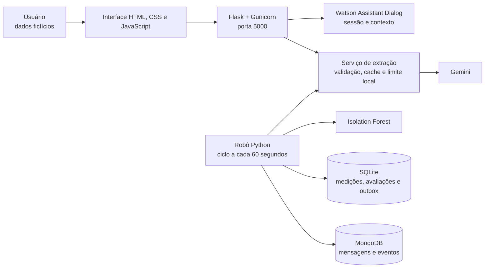

# FIAP — Faculdade de Informática e Administração Paulista

<p align="center">
  <a href="https://www.fiap.com.br/">
    
  </a>
</p>

# CardioIA — Assistente Conversacional e Automação Inteligente

**Projeto acadêmico FIAP — Fase 5 | 2026**

> Organização de relatos e medições fictícias com inteligência artificial, revisão humana e rastreabilidade.

---

## Nome do grupo

Rumo ao NEXT

## Integrantes

- Felipe Livino dos Santos — RM 563187
- Daniel Veiga Rodrigues de Faria — RM 561410
- Tomas Haru Sakugawa Becker — RM 564147
- Daniel Tavares de Lima Freitas — RM 562625
- Gabriel Konno Carrozza — RM 564468

## Professores

### Tutor

- Caique Nonato da Silva Bezerra

### Coordenador

- André Godoi Chiovato

---

## Sumário

- [1. Contexto e objetivo](#1-contexto-e-objetivo)
- [2. O que foi entregue](#2-o-que-foi-entregue)
- [3. Stack](#3-stack)
- [4. Arquitetura geral](#4-arquitetura-geral)
- [5. Execução com Docker](#5-execução-com-docker)
- [6. Configuração e fluxo do Watson](#6-configuração-e-fluxo-do-watson)
- [7. Ir Além 1: extração estruturada com Gemini](#7-ir-além-1-extração-estruturada-com-gemini)
- [8. Ir Além 2: automação e detecção de anomalias](#8-ir-além-2-automação-e-detecção-de-anomalias)
- [9. Testes e evidências](#9-testes-e-evidências)
- [10. Dados, privacidade e limites do protótipo](#10-dados-privacidade-e-limites-do-protótipo)
- [11. Estrutura do repositório](#11-estrutura-do-repositório)
- [12. Documentos da entrega](#12-documentos-da-entrega)
- [13. Vídeo de apresentação](#13-vídeo-de-apresentação)
- [14. Referências](#14-referências)
- [15. Licença](#15-licença)

---

## 1. Contexto e objetivo

O **CardioIA** é um protótipo acadêmico da Fase 5 que integra **Watson Assistant Dialog, Flask e HTML** para organizar relatos e medições fictícias em uma conversa. O usuário pode informar dados, consultar um resumo, corrigir campos e confirmar o conteúdo registrado.

O projeto inclui os dois desafios **Ir Além**:

- **Ir Além 1:** extração estruturada de informações de um relato com **Gemini 3.5 Flash Lite**, preservando evidências textuais e estados de afirmação, negação e incerteza.
- **Ir Além 2:** automação em Python com **SQLite, MongoDB e Isolation Forest** para processar medições sintéticas, registrar desvios estatísticos e sincronizar eventos.

Todos os dados de demonstração são fictícios. A aplicação não faz diagnóstico nem recomenda tratamentos. A confirmação do resumo representa uma conferência do conteúdo pelo usuário, sem validação clínica.

O planejamento completo e seu andamento estão em [PLANO_IMPLEMENTACAO.md](./PLANO_IMPLEMENTACAO.md).

## 2. O que foi entregue

| Área | Entrega |
| --- | --- |
| Assistente conversacional | Watson Dialog com 14 intenções, 70 exemplos, cinco entidades e 34 nós |
| Interface | Aplicação Flask com HTML, CSS e JavaScript, conversa e resumo para conferência |
| Gestão de contexto | Sessão reutilizada durante a conversa, correção de campos e reinício |
| Extração generativa | Fatos estruturados com valor, evidência literal e estado |
| Automação | Robô periódico para processamento de medições e mensagens sintéticas |
| Detecção de anomalias | Isolation Forest treinado e avaliado em conjuntos sintéticos separados |
| Persistência | SQLite para avaliações, alertas e execuções; MongoDB para documentos e eventos sincronizados |
| Recuperação de falhas | Fila persistente `outbox` e sincronização por `upsert` |
| Execução | Docker Compose com aplicação, robô e MongoDB |
| Evidências | Testes automatizados, avaliações com APIs reais, três relatórios PDF e vídeo demonstrativo |

## 3. Stack

| Camada | Tecnologia |
| --- | --- |
| Interface | HTML, CSS e JavaScript, sem dependências externas de frontend |
| Backend | Python 3.12.12 + Flask 3.1.3 |
| Servidor HTTP | Gunicorn 26.2.0 |
| Assistente | IBM Watson Assistant Dialog, API v2 e SDK `ibm-watson` 11.2.0 |
| Extração generativa | Gemini, com modelo padrão `gemini-3.5-flash-lite` e SDK `google-genai` 2.22.0 |
| Banco relacional | SQLite, embutido no Python |
| Banco documental | MongoDB 8.0 + PyMongo 4.18.0 |
| Detecção de anomalias | Isolation Forest, com scikit-learn 1.9.0 |
| Testes | `unittest` e scripts de avaliação |
| Orquestração | Docker Compose |

As dependências estão em [requirements.txt](./requirements.txt) e [automation/requirements.txt](./automation/requirements.txt).

## 4. Arquitetura geral



O navegador acessa o backend Flask, que mantém a sessão do Watson e integra o serviço de extração. O robô utiliza o mesmo serviço Gemini para interpretar mensagens textuais do MongoDB.

Os serviços do Compose são:

- `app`: interface, integração Watson e extração com Gemini;
- `mongo`: banco documental, habilitado pelo perfil `automacao`;
- `robot`: processamento periódico e sincronização, habilitado pelo perfil `automacao`.

SQLite fica em `/app/runtime`, no volume compartilhado `app_data`. MongoDB usa o volume `mongo_data`, sem porta publicada no host. Como SQLite é embutido no Python, não existe um container separado para ele.

## 5. Execução com Docker

### 5.1 Pré-requisitos

- Docker Desktop com containers Linux;
- Docker Compose;
- navegador;
- credenciais do Watson e do Gemini para as integrações externas.

Python e bancos não precisam ser instalados no computador.

### 5.2 Configuração

Na raiz do repositório, copie [.env.example](./.env.example) para `.env` se o arquivo ainda não existir. No PowerShell:

```powershell
if (-not (Test-Path .env)) { Copy-Item .env.example .env }
```

Preencha as variáveis locais:

| Variável | Finalidade |
| --- | --- |
| `FLASK_SECRET_KEY` | Segredo próprio e aleatório da aplicação |
| `MONGO_PASSWORD` | Senha própria e aleatória do MongoDB |
| `WA_API_KEY` | Credencial da instância Watson |
| `WA_URL` | URL do serviço Watson |
| `WA_ASSISTANT_ID` | Identificador do assistente |
| `WA_ENVIRONMENT_ID` | Identificador do ambiente do assistente |
| `GEMINI_API_KEY` | Credencial da API Gemini |
| `GEMINI_MODEL` | Modelo de extração; padrão `gemini-3.5-flash-lite` |
| `APP_PORT` | Porta local da aplicação; padrão `5000` |

Nunca publique o arquivo `.env`.

### 5.3 Subir a aplicação completa

```sh
docker compose --profile automacao up --build -d
docker compose ps
```

| Acesso | Endereço | Finalidade |
| --- | --- | --- |
| Interface | [localhost:5000](http://localhost:5000) | Conversa e organização de relatos |
| Healthcheck | [localhost:5000/health](http://localhost:5000/health) | Verificação do processo HTTP |
| Status | [localhost:5000/api/status](http://localhost:5000/api/status) | Presença de configuração das integrações |

Se a porta estiver ocupada, altere `APP_PORT` no `.env` e use a nova porta nos endereços acima. Após editar variáveis, repita `docker compose --profile automacao up -d`; `restart` sozinho não injeta a configuração alterada.

Para executar apenas a interface e a extração:

```sh
docker compose up --build -d app
```

Sem chaves das APIs, interface e processamento numérico funcionam, enquanto chamadas externas exibem configuração pendente. Os endpoints de saúde e status não garantem autenticação nas APIs externas.

### 5.4 Logs e desligamento

```sh
docker compose logs --tail 30 app robot
docker compose --profile automacao down
```

O encerramento preserva os volumes. `down -v` apaga os dados e não faz parte da execução normal.

## 6. Configuração e fluxo do Watson

### 6.1 Importação do diálogo

Crie um assistente, ative **Assistant settings > Dialog** e abra **Dialog > Options > Upload / Download**. Importe [watson/assistant-skill.json](./watson/assistant-skill.json) em um diálogo novo; a importação substitui o conteúdo existente. Não altere um assistente de outro projeto.

Consulte as credenciais da instância IBM para `WA_API_KEY` e `WA_URL`. Na configuração do assistente, use seu ID em `WA_ASSISTANT_ID`; em **Environments > Settings > API details**, copie o ID do ambiente para `WA_ENVIRONMENT_ID`.

O SDK 11.2.0 exige os dois identificadores separados. O cliente também envia um `user_id` opaco por sessão, sem dados pessoais. O código usa a API v2 com sessão e a versão de API indicada no [.env.example](./.env.example).

### 6.2 Roteiro de interação

```text
Quero registrar minha pressão
→ 120/80 mmHg
→ Mostre o resumo
→ Sim, está correto
```

Também estão disponíveis relato, histórico, correção, ajuda e reinício. O mesmo perfil do navegador compartilha a sessão entre abas; perfis distintos são isolados.

O [fluxo conversacional](./docs/fluxo-conversacional.md) documenta os caminhos, estados e limites da coleta.

### 6.3 Fonte e exportação

[watson/build_skill.py](./watson/build_skill.py) é a fonte editável do diálogo. Regenerar o JSON requer nova importação e validação. O JSON de entrega foi extraído da exportação oficial da API v2; [watson/export-provenance.json](./watson/export-provenance.json) registra origem e hash.

Para reexportar:

```sh
docker compose run --rm --no-deps app python -m watson.export_skill
```

Copie os arquivos gerados em `/app/runtime` usando `docker compose cp`.

## 7. Ir Além 1: extração estruturada com Gemini

Na aba **Organizar relato**, use o exemplo fictício, solicite a extração e revise valores, estados e evidências. Com uma conversa ativa, inclua o relato no contexto do Watson. A confirmação não valida clinicamente o conteúdo.

Também é possível executar a extração pela linha de comando:

```sh
docker compose run --rm --no-deps app python -m extensions.generative.extract_clinical --text "Minha frequência foi 72 bpm. Não tenho dor."
```

A saída contém `fatos`, com `campo`, `valor`, `evidencia` e `estado` (`afirmado`, `negado`, `incerto`). A validação exige trechos literais e rejeita chaves desconhecidas. Isso reduz invenções, mas não prova completude ou correção semântica; a revisão humana continua necessária.

O modelo padrão é `gemini-3.5-flash-lite`, configurável em `GEMINI_MODEL`. O controle local de uso aplica:

- até 500 tentativas em uma janela móvel de 24 horas, compartilhadas entre aplicação e robô;
- intervalo mínimo de 10 segundos entre tentativas;
- reutilização de resultados iguais por 24 horas;
- contagem de falhas como tentativas, sem repetição automática.

A cota efetiva é definida pelo Google e inclui outros aplicativos da mesma conta/projeto; o contador local não mede esse consumo externo.

## 8. Ir Além 2: automação e detecção de anomalias

### 8.1 Processamento e persistência

O perfil `automacao` inicializa os bancos automaticamente. O robô executa um ciclo a cada 60 segundos, treina Isolation Forest em 240 linhas sintéticas e avalia 63 linhas separadas de monitoramento. As três situações controladas são desvio injetado (301), referência (302) e dado ausente (303).

O modelo usa quatro atributos: pressão sistólica, pressão diastólica, frequência e adesão. Anomalias são desvios estatísticos do conjunto artificial, sem significado diagnóstico. Dados inválidos geram eventos próprios.

O robô salva avaliação, alerta, identificador de execução e versão do modelo no SQLite. Uma fila persistente `outbox` replica eventos no MongoDB por `upsert`, permitindo repetir a sincronização após falhas sem duplicar alertas. As mensagens textuais do MongoDB são interpretadas pelo mesmo serviço Gemini, preservando pendências quando falta chave ou cota.

As estruturas estão documentadas no [schema relacional](./database/relational/schema.sql) e no [README do banco documental](./database/nonrelational/README.md).

### 8.2 Executar um ciclo isolado

Pare primeiro o robô periódico:

```sh
docker compose stop robot
docker compose --profile automacao run --rm robot python -m automation.robot --once
docker compose --profile automacao up -d robot
```

O bloqueio no volume impede dois robôs simultâneos. O conjunto inicial é fixo: ciclos seguintes processam zero medições novas, mas continuam verificando mensagens e sincronização.

### 8.3 Adicionar uma medição de demonstração

Use [automation/add_measurement.py](./automation/add_measurement.py) conforme sua ajuda. Exemplo:

```sh
docker compose exec robot python -m automation.add_measurement --systolic 120 --diastolic 80 --heart-rate 72 --adherence 1
docker compose exec robot python -m automation.inspect_data
```

## 9. Testes e evidências

### 9.1 Testes automatizados

```sh
docker compose run --rm --no-deps app python -m unittest discover -s tests -v
docker compose --profile automacao run --rm --no-deps robot python -m unittest discover -s automation/tests -v
```

Os testes usam substitutos controlados das APIs externas; eles não medem a qualidade do Watson/Gemini.

### 9.2 Validação com APIs reais

```sh
docker compose exec app python tests/live_workflow.py
docker compose run --rm --no-deps app python -m watson.evaluate
```

O primeiro script verifica contexto, correção, isolamento, extração e reinício. O segundo avalia 42 frases inéditas e faz chamadas reais ao Watson. A reprodução requer credenciais válidas e está sujeita às cotas dos serviços.

### 9.3 Resultados documentados

Os resultados abaixo correspondem à verificação registrada em **4 de setembro de 2026**, conforme [docs/VALIDACAO.md](./docs/VALIDACAO.md).

| Verificação | Resultado registrado | Limite |
| --- | --- | --- |
| Testes de código | 26 testes do núcleo/extração e cinco do robô aprovados | APIs externas substituídas por respostas controladas |
| Integração Watson/Gemini | Fluxo real aprovado pela API HTTP | Cenários fictícios |
| Classificação Watson | 38 de 42 frases conforme a referência: 90,5% | Quatro diferenças documentadas; amostra acadêmica pequena |
| Extração Gemini | Seis de seis saídas passaram esquema/evidências; todos os seis fatos da referência inicial foram encontrados | Um fato adicional apoiado no texto exigiu revisão da referência |
| Automação | 240 medições de treino, 63 avaliadas, 11 alertas e zero eventos pendentes | Distribuição artificial, sem conclusão clínica |
| Persistência e sincronização | Recuperação após indisponibilidade do MongoDB, sem duplicar os 11 alertas | Falha testada em ambiente local controlado |
| Relatórios | Três PDFs de duas páginas, renderizados e revisados | Evidência da entrega documentada |

Resultados completos, limitações e verificações pendentes estão em [docs/VALIDACAO.md](./docs/VALIDACAO.md) e nos [artefatos de evidência](./docs/evidence/).

## 10. Dados, privacidade e limites do protótipo

- Todos os relatos, medições e mensagens de demonstração são fictícios.
- O sistema não faz diagnóstico nem recomenda tratamentos.
- A confirmação de um resumo não equivale a uma validação clínica.
- Evidências literais na extração não garantem completude ou correção semântica.
- Os alertas do Isolation Forest representam desvios estatísticos em dados artificiais.
- `.env`, materiais das aulas e diretórios de execução permanecem fora do repositório público, conforme [.gitignore](./.gitignore).
- Healthchecks e presença de configuração não comprovam autenticação nas APIs externas.

Permanecem pendentes na documentação: revisão em tela estreita, execução integral da matriz original, reimportação da exportação final em outra conta/máquina e avaliação da variação entre gerações independentes do Gemini. O andamento está no [plano de implementação](./PLANO_IMPLEMENTACAO.md).

## 11. Estrutura do repositório

```text
cap1-fase5-v2/
├── asset/
│   └── logo-fiap.png              # identidade institucional
├── automation/                   # robô, dados sintéticos e modelo
│   └── tests/                    # testes do pipeline de automação
├── database/
│   ├── relational/               # schema SQLite
│   └── nonrelational/            # documentação MongoDB
├── docs/
│   ├── evidence/                 # resultados das verificações
│   ├── fluxo-conversacional.md
│   ├── roteiro-video.md
│   └── VALIDACAO.md
├── extensions/
│   └── generative/               # prompt, extração e avaliação Gemini
├── output/
│   ├── pdf/                      # três relatórios da entrega
│   └── video/                    # demonstração e metadados
├── services/                     # sessões, integrações e validação
├── static/                       # CSS e JavaScript
├── templates/                    # interface HTML servida pelo Flask
├── tests/                        # testes do núcleo e integração
├── watson/                       # definição, exportação e avaliação
├── .env.example
├── app.py
├── compose.yaml
├── config.py
├── Dockerfile
├── PLANO_IMPLEMENTACAO.md
├── requirements.txt
└── README.md
```

## 12. Documentos da entrega

| Documento | Conteúdo |
| --- | --- |
| [Plano de implementação](./PLANO_IMPLEMENTACAO.md) | Escopo, fases, critérios e andamento |
| [Fluxo conversacional](./docs/fluxo-conversacional.md) | Caminhos, estados e limites do assistente |
| [Exportação oficial Watson](./watson/assistant-skill.json) | Diálogo para importação |
| [Procedência da exportação](./watson/export-provenance.json) | Origem e hash do JSON |
| [Relatório do fluxo conversacional](./output/pdf/fluxo-conversacional.pdf) | PDF de duas páginas |
| [Relatório Ir Além 1 — Extração](./output/pdf/ir-alem-1-extracao.pdf) | PDF de duas páginas |
| [Relatório Ir Além 2 — Automação](./output/pdf/ir-alem-2-automacao.pdf) | PDF de duas páginas |
| [Resultados e limites das verificações](./docs/VALIDACAO.md) | Evidências e pendências |
| [Roteiro do vídeo](./docs/roteiro-video.md) | Sequência da apresentação |

A publicação no GitHub será realizada pelo responsável pelo projeto. As contribuições individuais devem ser registradas antes do envio à faculdade.

## 13. Vídeo de apresentação

▶️ [Assista à demonstração do CardioIA — 2min52s](./output/video/cardioia-demonstracao.mp4)

O vídeo reúne capturas reais da aplicação e narração sintetizada. É uma demonstração montada a partir de capturas, sem gravação contínua das interações. Os metadados estão em [output/video/demonstracao.json](./output/video/demonstracao.json).

## 14. Referências

### 14.1 Base acadêmica

| Material | Conteúdo utilizado |
| --- | --- |
| PCV, capítulo 10 — Arquitetura Cognitiva dos LLMs Modernos | pp. 17–37: Watson; pp. 46–49: Flask/HTML; pp. 57–63: APIs e integração híbrida |
| AIRPA, capítulo 2 — Do Banco de Dados à Automação Inteligente | pp. 9–11: SQLite; pp. 23–30: Isolation Forest; pp. 46–48: MongoDB |

Os PDFs das aulas e o enunciado ficam apenas no ambiente local. Docker foi incluído por requisito do projeto.

### 14.2 Documentação técnica

- [Modelo Gemini 3.5 Flash Lite](https://ai.google.dev/gemini-api/docs/models/gemini-3.5-flash-lite)
- [SDK Google Gen AI](https://googleapis.github.io/python-genai/)
- [IBM Watson Assistant — Dialog](https://cloud.ibm.com/docs/watson-assistant?topic=watson-assistant-skill-dialog-add)

## 15. Licença

Uso acadêmico no projeto FIAP — Fase 5. A atribuição abaixo refere-se ao modelo institucional de README fornecido como referência.

<p>
  
  
  Modelo institucional FIAP licenciado sob
  <a href="https://creativecommons.org/licenses/by/4.0/" target="_blank" rel="license noopener noreferrer">Creative Commons Attribution 4.0 International</a>.
</p>
