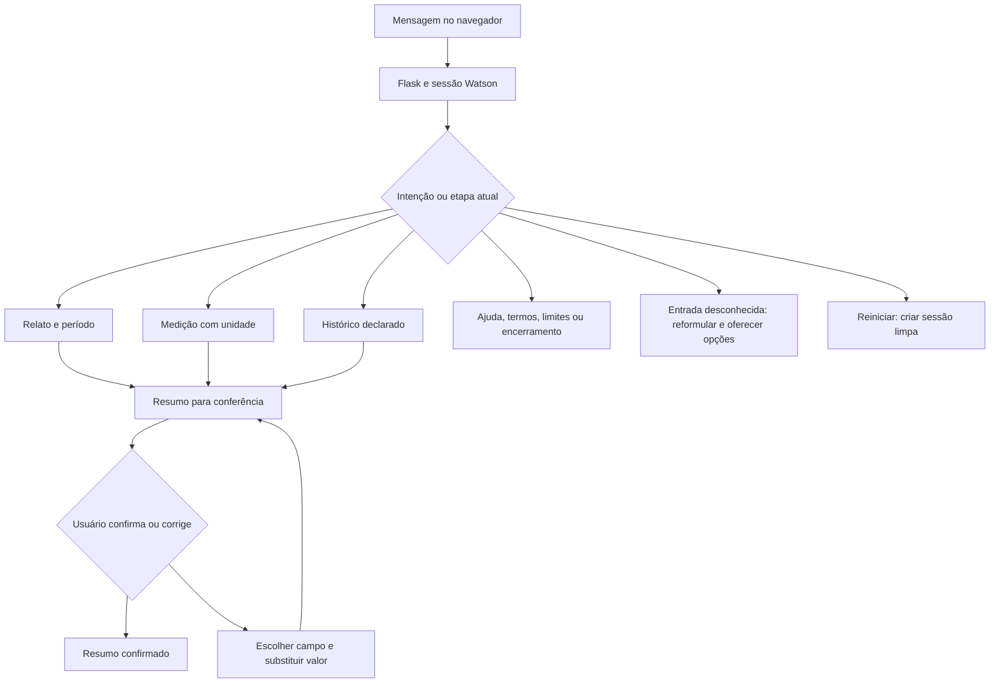

# Fluxo conversacional implementado

O núcleo organiza relatos e medições fictícias usando Watson Assistant, Flask e HTML. Não depende de Gemini nem da automação para conversar. Intenções, entidades, respostas e condições estão em `watson/build_skill.py`; a exportação usada na entrega está em `watson/assistant-skill.json`.



## Caminhos e estado

| Caminho | Entrada e resposta esperada | Estado conservado |
| --- | --- | --- |
| Pressão | `Quero registrar minha pressão` → pedir formato → `120/80 mmHg` → solicitar conferência | Texto literal da pressão e confirmação pendente |
| Frequência | `Anotar frequência cardíaca` → pedir unidade → `72 bpm` → solicitar conferência | Texto literal da frequência |
| Relato | `Quero contar meus sintomas` → pedir relato → texto livre → perguntar período → `desde ontem` | Relato original e período declarado |
| Sintoma na frase | `Tenho sentido cansaço` → perguntar período | Frase inteira; entidade não implica afirmação clínica isolada |
| Histórico | `Quero informar meu histórico de saúde` → pedir texto → relato fictício | Histórico literal |
| Resumo | `Mostre o resumo` → orientar conferência no painel | Muda para etapa de confirmação sem apagar campos |
| Confirmação | `Sim, está correto` após consultar resumo | Indicador confirmado |
| Correção | `Preciso corrigir um dado` → `pressão` → `125/82 mmHg` | Substitui pressão; confirmação volta a pendente |
| Ajuda/termos | `Como funciona?` ou `O que significa bpm?` | Resposta previamente escrita |
| Limites/urgência | Pedido de diagnóstico ou declaração explícita de emergência | Orientação breve; sem decisão clínica automática |
| Fallback | Entrada sem intenção reconhecida → reformular; repetição → opções | Contador de tentativas |
| Encerramento | `Quero terminar a conversa` | Finaliza fluxo; o resumo continua visível |
| Reinício | Botão Nova conversa ou `Reinicie o atendimento` | Nova sessão remota e resumo limpo |

Ajuda, resumo, correção, reinício e outros comandos globais precedem a captura de texto livre. Uma medição sem unidade recebe orientação de formato. Pressão e frequência com unidades podem ser enviadas juntas: `120/80 mmHg e 72 bpm` registra os dois valores.

## Critérios de conversação — revisão de 7 de setembro de 2026

O diálogo passou a ter 22 intenções, 125 exemplos, seis entidades e 69 nós. O objetivo é permitir que a pessoa converse sem precisar decorar uma sequência de comandos. O assistente continua se apresentando como virtual, com a indicação de simulação preservada na interface.

| Critério | Exemplo e comportamento esperado |
| --- | --- |
| Pergunta ligada à etapa atual | `Pode explicar de outro jeito?` retoma a pergunta pendente sem registrar a dúvida como relato |
| Reconhecer frustração | `Você não entendeu o que eu pedi` reformula a pergunta e conserva os dados |
| Permitir não responder | `Prefiro pular essa parte` encerra a coleta atual, sem preencher um dado novo |
| Preservar incerteza | `Não lembro quando começou` deixa o período sem informação; não inventa uma data |
| Agradecer sem encerrar | Um agradecimento isolado recebe resposta breve; durante a coleta, retoma a pergunta atual |
| Trocar de assunto | Um pedido de medição durante a coleta de relato abre a etapa de medição, sem virar texto de sintoma |
| Corrigir na própria mensagem | `Corrige a pressão para 125/82 mmHg` substitui esse campo, conserva os outros e retira a confirmação anterior |
| Recusar confirmação | `Não` na conferência leva à escolha do campo a corrigir |
| Não confirmar resumo vazio | `Sim` sem dados não cria um registro confirmado |
| Receber duas medições | Pressão em mmHg e frequência em bpm na mesma mensagem aparecem juntas no resumo |
| Cancelar somente a etapa | Cancelar a pergunta preserva informações registradas; Nova conversa limpa o contexto |
| Explicar identidade e escopo | Perguntas sobre atendimento humano ou assuntos alheios recebem resposta explícita, sem serem salvas como histórico |
| Oferecer atalhos relevantes | Os botões mudam conforme a resposta: confirmar/corrigir, escolher medição ou pular/reformular |

As respostas usam frases curtas, perguntas específicas e confirmação do valor recebido. Nenhum botão preenche números fictícios em nome do usuário. Negação em um relato, como `Não sinto dor`, permanece no texto original.

Validação reproduzível com a API Watson real:

```sh
docker compose exec app python tests/live_conversation.py
```

O roteiro cobre dez cenários e 31 turnos, incluindo os caminhos acima. O relatório fica em `/app/runtime/conversation-evaluation.json`; a evidência versionada está em `docs/evidence/conversation-evaluation.json`. Os casos que motivaram ajustes são regressões conhecidas, e não uma amostra cega independente. A classificação pode variar em outras formulações. Não há interpretação clínica, inferência automática de unidades ou garantia de compreensão de qualquer texto livre.

Para atualizar novamente o rascunho deste projeto, execute `docker compose exec app python -m watson.update_dialog` após reconstruir a imagem. O script verifica o ambiente e a identificação do projeto, salva a versão anterior no volume e altera somente o diálogo. Aguarde o treinamento, execute a avaliação e reexporte com `python -m watson.export_skill`; copie o JSON e sua procedência para `watson/`. A atualização é feita com [Update skill da API IBM](https://cloud.ibm.com/docs/apis/assistant-v2#update-skill).

## Integração e limites verificados

O navegador recebe somente resposta e resumo filtrado. A sessão usa token opaco; o backend persiste contexto e identificador Watson em SQLite. Perfis distintos são isolados, enquanto abas do mesmo perfil compartilham cookies. Encerrar o fluxo não exclui a sessão remota; o reinício substitui essa sessão.

`tests/live_workflow.py` validou por HTTP real medições, contexto, confirmação, correção, isolamento entre clientes, extração e reinício. `docs/evidence/watson-evaluation.json` conserva os 42 casos inéditos: 38 classificações conforme referência e quatro diferenças. Os demais caminhos estão definidos na skill e cobertos parcialmente pelos testes; não se afirma que todas as combinações possíveis foram executadas na API real.

A extensão Gemini inclui o texto original e os fatos revisados no contexto. Esses fatos não sobrescrevem automaticamente as medições do painel. A automação funciona de modo periódico e separado.

Integrantes, contribuições, prazo e URL pública serão informados pelo responsável pela entrega; esses dados não foram inventados.
