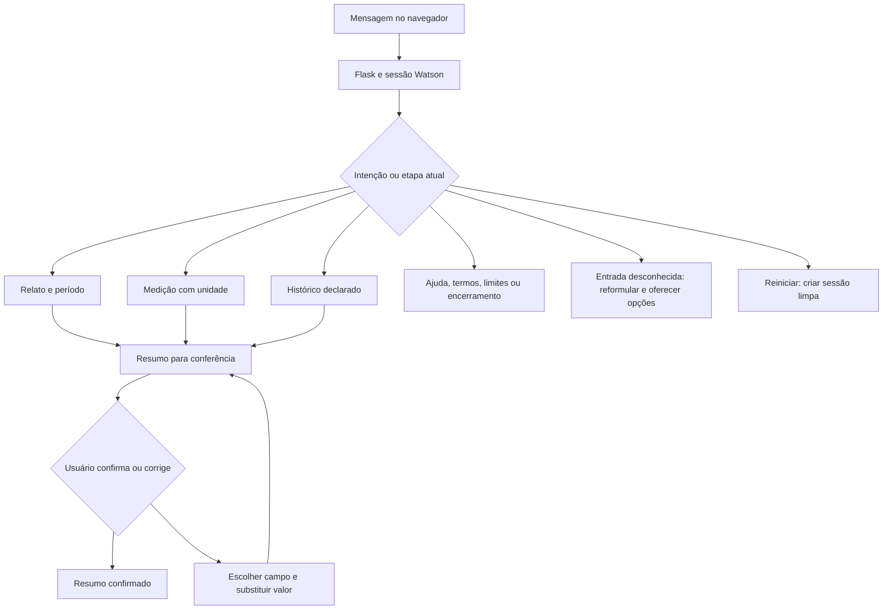

# Fluxo conversacional implementado

O núcleo organiza relatos e medições fictícias usando Watson Assistant, Flask e HTML. Não depende de Gemini nem da automação para conversar. Intenções, entidades, respostas e condições estão em `watson/build_skill.py`; a exportação usada na entrega está em `watson/assistant-skill.json`.

## Caminhos e estado

| Caminho | Entrada e resposta esperada | Estado conservado |
| --- | --- | --- |
| Pressão | `Quero registrar minha pressão` → pedir formato → `120/80 mmHg` → solicitar conferência | Texto literal da pressão e confirmação pendente |
| Frequência | `Anotar frequência cardíaca` → pedir unidade → `72 bpm` → solicitar conferência | Texto literal da frequência |
| Relato | `Quero contar meus sintomas` → pedir relato → texto livre → perguntar período → `desde ontem` | Relato original e período declarado |
| Sintoma na frase | `Tenho sentido cansaço` → perguntar período | Frase inteira; entidade não implica afirmação clínica isolada |
| Histórico | `Quero informar meu histórico de saúde` → pedir texto → relato fictício | Histórico literal |
| Resumo | `Mostre o resumo` → orientar conferência no painel | Muda para etapa de confirmação sem apagar campos |
| Confirmação | `Sim, está correto` após consultar resumo | Indicador confirmado |
| Correção | `Preciso corrigir um dado` → `pressão` → `125/82 mmHg` | Substitui pressão; confirmação volta a pendente |
| Ajuda/termos | `Como funciona?` ou `O que significa bpm?` | Resposta previamente escrita |
| Limites/urgência | Pedido de diagnóstico ou declaração explícita de emergência | Orientação breve; sem decisão clínica automática |
| Fallback | Entrada sem intenção reconhecida → reformular; repetição → opções | Contador de tentativas |
| Encerramento | `Quero terminar a conversa` | Finaliza fluxo; o resumo continua visível |
| Reinício | Botão Nova conversa ou `Reinicie o atendimento` | Nova sessão remota e resumo limpo |

Ajuda, resumo, correção, reinício e outros comandos globais precedem a captura de texto livre. Uma medição sem unidade recebe orientação de formato. Pressão e frequência devem ser enviadas em mensagens separadas: quando ambas estão na mesma mensagem, o primeiro nó de medição aplicável pode registrar somente uma delas.

## Integração e limites verificados

O navegador recebe somente resposta e resumo filtrado. A sessão usa token opaco; o backend persiste contexto e identificador Watson em SQLite. Perfis distintos são isolados, enquanto abas do mesmo perfil compartilham cookies. Encerrar o fluxo não exclui a sessão remota; o reinício substitui essa sessão.

`tests/live_workflow.py` validou por HTTP real medições, contexto, confirmação, correção, isolamento entre clientes, extração e reinício. `docs/evidence/watson-evaluation.json` conserva os 42 casos inéditos: 38 classificações conforme referência e quatro diferenças. Os demais caminhos estão definidos na skill e cobertos parcialmente pelos testes; não se afirma que todas as combinações possíveis foram executadas na API real.

A extensão Gemini inclui o texto original e os fatos revisados no contexto. Esses fatos não sobrescrevem automaticamente as medições do painel. A automação funciona de modo periódico e separado.

Integrantes, contribuições, prazo e URL pública serão informados pelo responsável pela entrega; esses dados não foram inventados.
